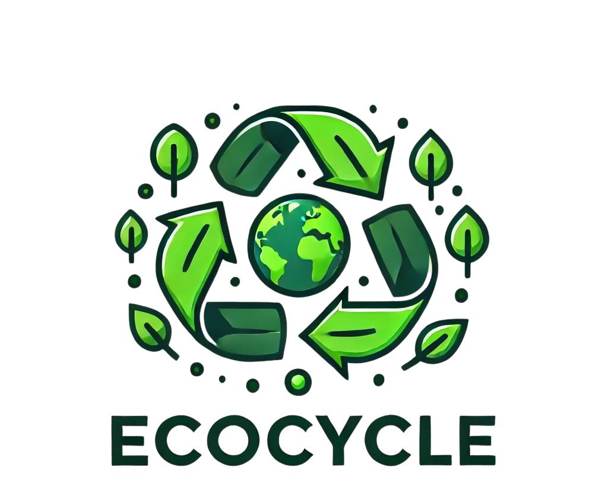
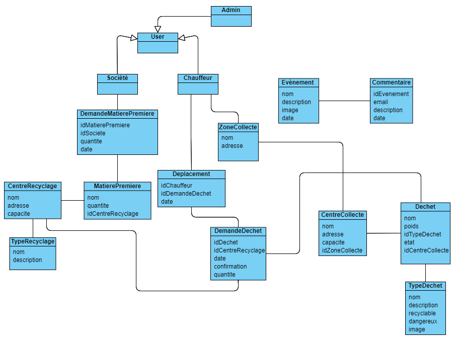

# Gestion des Déchets et Recyclage

## Description
Cette application vise à encourager le recyclage et la gestion responsable des déchets en fournissant un outil facile à utiliser pour localiser les centres de recyclage, apprendre les meilleures pratiques de réduction des déchets, et organiser des événements de collecte de déchets communautaires.

### Diagramme de classes

